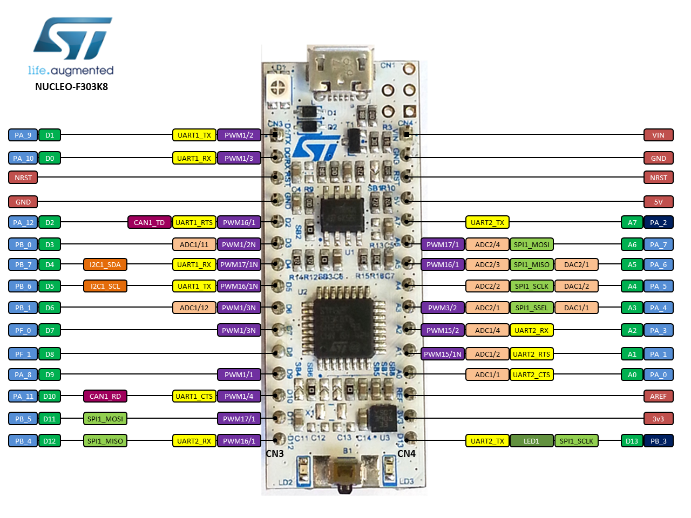
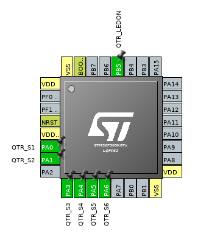

# LineFollower_Started
Projetos usando os componentes básicos do seguidor de linha.

## QTR-8A Raw Example on STM
O projeto tem como objetivo dar um parâmetro de quão alinhado à linha da pista está o robô. Para isso usa-se o Nucleo-STM32F303K8 e uma _QTR-8A sensor array_ da polulu. O sensor tem saída analógica, portanto deve-se usar o _ADC_ do micro. E para ter o parâmetro do alinhamento do robô far-se-á uma média ponderada dos valores dos sensores.

1. Configuração do micro

1.1 Configuração das portas

Será utilizado apenas 6 sensores da barra de sensores, e foram conectados do Sensor-1 ao Sensor-6 às portas A0 a A5 (estes devem ser configurados como ADC*x*_IN*y* conforme a especificação do micro) e o pino *LEDON* é conectado à porta D11 como GPIO_OUTPUT.

## QTR-8A Raw Example on Arduino

texto thallia
